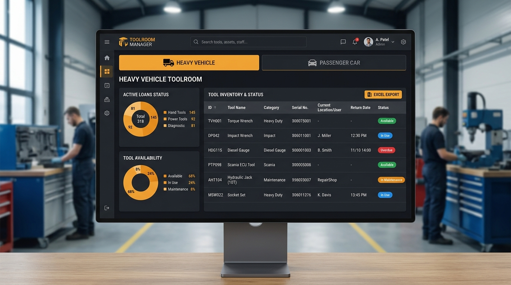
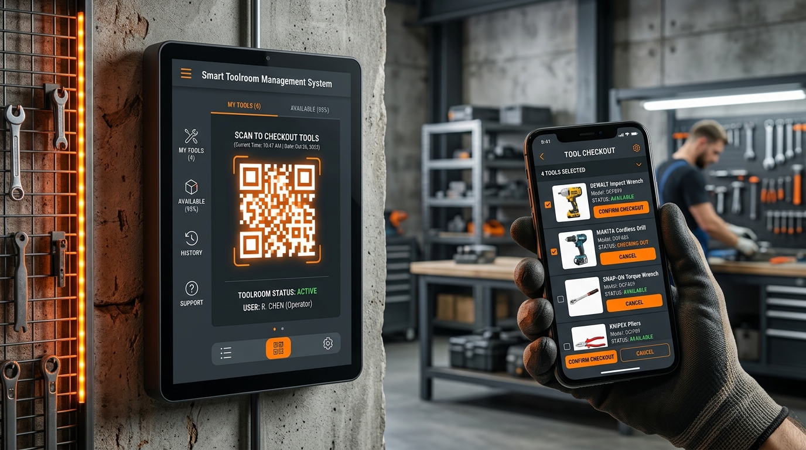

# 🛠️ Takımhane Yönetim Sistemi (Toolroom Management System)

<p align="center">
  
</p>

<p align="center">
  
  
  
  
  
</p>

---

## 📌 Proje Hakkında

**Takımhane Yönetim Sistemi**, endüstriyel atölyeler, araç servisleri ve üretim tesislerindeki el aletleri, özel takım ve aparatların, dolap-raf-göz lokasyonlarının, zimmet süreçlerinin ve personel hareketlerinin uçtan uca dijital olarak takip edilmesini sağlayan yeni nesil bir kurumsal yönetim platformudur.

Birden fazla atölyeye sahip işletmeler için tasarlanan **Çoklu Takımhane Mimarisi** sayesinde, her birim kendi verilerini tamamen izole bir şekilde yönetirken, yönetim kadrosu tek bir merkezden tüm tesisi denetleyebilir.

---

## 🖼️ Ekran Görüntüleri

| Modern Yönetim Paneli | Self-Servis Kiosk & QR Ekranı |
| :---: | :---: |
|  |  |
| *Gerçek zamanlı stok, zimmet ve hareket analizleri* | *İstasyon bazlı, dinamik QR kodlu self-servis teslim/iade* |

---

## 🌟 Temel Özellikler

### 🏢 1. Çoklu Takımhane & Rol Tabanlı İzolasyon (Multi-Toolroom)
- **Birim Ayrımı:** Örneğin *Ağır Vasıta Takımhanesi* ve *Otomobil / Hafif Ticari Araçlar (HTA) Takımhanesi* gibi birden fazla takımhane bağımsız çalışır.
- **Sorumlu İzolasyonu:** A Takımhanesi sorumlusu yalnızca kendi takımhanesindeki takımları, rafları ve zimmetleri görür; B Takımhanesi sorumlusu diğer birimin verilerine erişemez.
- **Süper Admin Denetimi:** Genel yöneticiler tüm takımhaneleri eş zamanlı izleyebilir, aralarında filtreleme yapabilir ve birimler arası takım transferi sağlayabilir.

### 🔧 2. Akıllı Takım ve Envanter Yönetimi
- **Hiyerarşik Depolama:** Takımlar fiziksel konumlarına göre **Blok (Dolap) → Raf → Göz (Kutu/Slot)** şeklinde haritalandırılır.
- **Araç Grubu & Kategori Sınıflandırması:** Parçalar kullanım alanlarına göre (Ağır Vasıta, Binek, HTA vb.) ve kategorilerine göre filtrelenebilir.
- **Barkod & QR Desteği:** Her takım için otomatik QR/Barkod etiketleri üretilebilir ve yazdırılabilir.
- **Kritik Stok & Bakım Takibi:** Stokta azalan parçalar ve periyodik bakıma girmesi gereken takımlar için otomatik uyarı sistemi.

### 🔄 3. Hızlı Zimmet ve İade Takibi (Checkout / Check-in)
- **Personel Eşleştirme:** Takımlar personellere zimmetlenir, tahmini iade tarihi belirlenir.
- **Gecikme Uyarıları:** Belirtilen sürede teslim edilmeyen takımlar panelde ve raporlarda anında vurgulanır.
- **Kullanım Geçmişi:** Hangi takımın ne zaman, kim tarafından ve ne kadar süreyle kullanıldığı saniye saniye kaydedilir.

### 📱 4. Self-Servis Kiosk & Dinamik Güvenlikli QR Kod
- **Atölye İçi Kiosklar:** Atölye girişlerindeki tablet veya dokunmatik ekranlar için özel kiosk modu.
- **Dinamik QR Kod:** QR kod kopyalamalarını ve suiistimalleri önlemek için takımhane QR kodları belirli periyotlarla (haftalık/otomatik) dinamik olarak güncellenir.
- **Hızlı Teslim:** Usta veya teknisyen kendi QR kodunu ve parçayı okutarak saniyeler içinde zimmet işlemini tamamlar.

### 📊 5. Gelişmiş Raporlama & Yedekleme
- **Excel ve PDF Dışa Aktarımı:** Tek tıkla tüm parça listesi, aktif zimmetler veya tarih aralıklı kullanım raporları indirilebilir.
- **Görsel / Kompakt Çıktı:** Saha kullanımı ve resmi denetimler için fotoğraflı veya sadeleştirilmiş döküm seçenekleri.

---

## 🏗️ Teknoloji Mimarisi

- **Backend Framework:** [Laravel 11](https://laravel.com/)
- **Admin & UI Engine:** [Filament v3](https://filamentphp.com/) (TALL Stack: Tailwind, Alpine.js, Laravel, Livewire)
- **Veritabanı:** MySQL 8.0+
- **Frontend & Tasarım:** Blade, Tailwind CSS, Heroicons
- **Raporlama:** Maatwebsite Excel & DomPDF / Snappy
- **Gelecek Entegrasyonu:** C# (.NET) tabanlı masaüstü dokunmatik atölye terminali ve donanım entegrasyonu.

---

## 🚀 Kurulum Rehberi (Yerel Geliştirme)

### Gereksinimler
- PHP >= 8.2 (Gerekli uzantılar: `pdo`, `mbstring`, `openssl`, `gd`, `curl`, `xml`, `zip`)
- Composer >= 2.x
- MySQL >= 8.0 veya MariaDB >= 10.4
- Node.js >= 18.x & NPM

### Adım Adım Kurulum

1. **Depoyu Klonlayın:**
   ```bash
   git clone https://github.com/losing9/TakimhaneYonetimSistemi.git
   cd TakimhaneYonetimSistemi
   ```

2. **Bağımlılıkları Yükleyin:**
   ```bash
   composer install
   npm install && npm run build
   ```

3. **Ortam Değişkenlerini Ayarlayın:**
   ```bash
   cp .env.example .env
   php artisan key:generate
   ```
   `.env` dosyasını açarak veritabanı bağlantı bilgilerinizi girin:
   ```env
   DB_CONNECTION=mysql
   DB_HOST=127.0.0.1
   DB_PORT=3306
   DB_DATABASE=takimhane_db
   DB_USERNAME=root
   DB_PASSWORD=
   ```

4. **Veritabanı Tablolarını ve Başlangıç Verilerini Yükleyin:**
   ```bash
   php artisan migrate --seed
   php artisan storage:link
   ```

5. **Geliştirme Sunucusunu Başlatın:**
   ```bash
   php artisan serve
   ```
   Tarayıcınızdan `http://127.0.0.1:8000/admin` adresine giderek yönetim paneline erişebilirsiniz.

---

## 👥 Kullanıcı Rolleri & Erişim Matrisi

| Rol | Kapsam | Yetkiler |
| :--- | :--- | :--- |
| **Süper Admin** (`super_admin`) | Tüm Sistem | Tüm takımhaneler, kullanıcı yetkilendirme, yeni birim açma, genel raporlar ve ayarlar. |
| **Takımhane Sorumlusu** (`takimhane_sor`) | Atanan Takımhane (A veya B) | Sadece kendi takımhanesinin parçaları, dolap/raf gözleri, zimmetleri ve istasyon kioskları. |
| **Personel / Teknisyen** (`personel`) | Bireysel | Kendine ait zimmetleri görme, self-servis kiosk üzerinden takım alma/iade etme. |

---

## 🗺️ Yol Haritası (Roadmap)

- [x] Çoklu Takımhane Mimarisi (Ağır Vasıta & Otomobil/HTA)
- [x] Takımhane Sorumlusu Rol İzolasyonu
- [x] Dinamik QR Kod ve Self-Servis Kiosk Modu
- [x] Excel ve PDF Rapor Dışa Aktarımı
- [x] Gelişmiş Personel Tanımlama ve Hızlı Hesap Entegrasyonu
- [ ] **C# (.NET) Masaüstü Uygulaması:** Dokunmatik atölye terminalleri için offline-tolerant native masaüstü istemcisi
- [ ] **El Terminali / RFID Desteği:** Toplu takım sayımı ve RFID etiketli hızlı iade modülü
- [ ] **Lisanslama & Güvenlik Modülü:** Ticari dağıtım için lisans aktivasyon ve kod şifreleme altyapısı

---

## 📄 Lisans & Telif Hakkı

Bu yazılım özel ticari mülkiyete tabidir. İzinsiz kopyalanamaz, çoğaltılamaz ve dağıtılamaz.  
Tüm hakları saklıdır © 2026.
